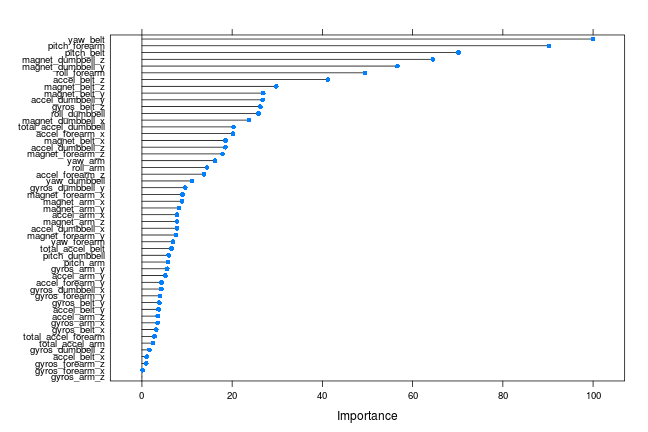
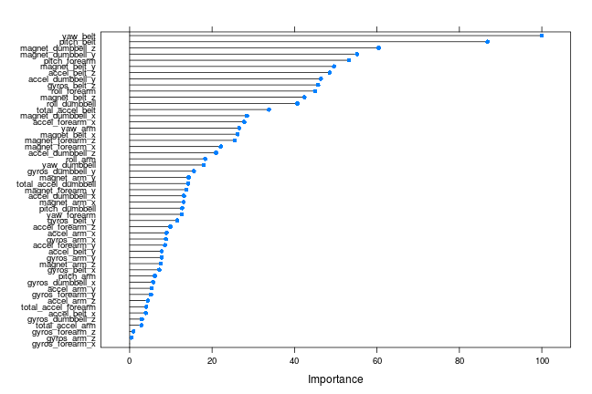
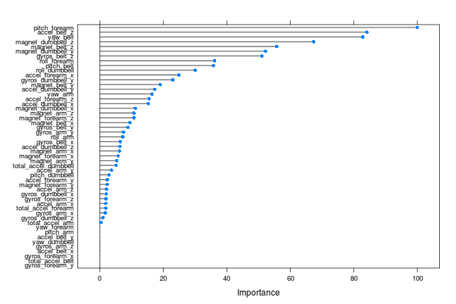

---
title: "Practical Machine Learning - Course Project"
date: \today
---   


```r
library(knitr)
opts_chunk$set(fig.align='center', warning=FALSE, message=FALSE)
library(RCurl)
library(caret)
library(randomForest)
library(gbm); library(plyr)
library(ipred)
library(MASS)
library(klaR)
options(digits=3)
```

## Synopsis   

The benefits that exercise confers on human health have been studied in great detail.  What has not been analyzed to a such a great extent is whether people exercising are in fact doing these exercises properly.  In fact, a definition of "how well" an individual is exercising has not been created in the popular lexicon. 

In the study [Qualitative Activity Recognition of Weight Lifting Exercises](http://groupware.les.inf.puc-rio.br/work.jsf?p1=11201), the researchers attempted to both define "how well" exercise was being done, as well as track the specific physical movements used in that definition.  There are a number of devices available (e.g. Jawbone Up, Nike FuelBand, and Fitbit) that can be utilized to gather very specific data about an individual's workout.  The researchers developed a five tier definition (A, B, C, D, E) defining "how well" an individual was performing a Unilateral Dumbbell Biceps Curl, using the Microsoft Kinect Sensor to track the subject's movements. Class A is considered to be the proper way to perform the exercise and Classes B-E are variations considered to be improper. 

The goal of this project is to develop a model to predict the "classe" of exercise (A, B, C, D, E) from a small test set pulled from the larger study set.

### Description of the Data   

The training data for this project are available here: 

[Training Set](https://d396qusza40orc.cloudfront.net/predmachlearn/pml-training.csv)

The test data are available here: 

[Test Set](https://d396qusza40orc.cloudfront.net/predmachlearn/pml-testing.csv)

The data for this project come from this source: http://groupware.les.inf.puc-rio.br/har.

The variables tracked correspond to four different aspects of study:  
1. Roll, pitch, and yaw (Euler angles of movement)  
2. Accelerometer, gyroscope, and magnetometer readings  
3. Statistical summaries of the items of the Euler angles (mean, variance, standard deviation, max, min, amplitude, kurtosis, and skewness)   
4. Sensors placed on the belt, arm, forearm, and dumbbell.

### Downloading and Loading the Dataset   
The data contains many empty fields as well as fields containing "#DIV/0!" where the original spreadsheet produced an error.  When loading the data, we will replace these fields with an "NA" field so that we can better analyze the data in R.  


```r
## Check to see if raw data files exist and download if not
if(!file.exists("./pml-training.csv")){
    download.file("https://d396qusza40orc.cloudfront.net/predmachlearn/pml-training.csv",
                  destfile="pml-training.csv", method="curl")
}
if(!file.exists("./pml-testing.csv")){
    download.file("https://d396qusza40orc.cloudfront.net/predmachlearn/pml-testing.csv",
                  destfile="pml-testing.csv", method="curl")
}

## Load WLED data, replacing blank and "#DIV/0!" fields with NAs
wled <- read.csv("./pml-training.csv", na.strings=c("", "NA", "#DIV/0!"))
```
### Exploring the Data
The overall dimensions of the data set are:


```r
dim(wled)
```

```
## [1] 19622   160
```

The variable we are most interested in is 'classe':

```r
summary(wled$classe)
```

```
##    A    B    C    D    E 
## 5580 3797 3422 3216 3607
```

As is stated above, there are many NA values in this set.  The overall percentage of NA values is:  

```r
(sum(is.na(wled)) / (dim(wled)[1] * dim(wled)[2])) * 100
```

```
## [1] 61.3
```

### Preprocessing the Data   

It was necessary to remove columns with a high percentage of NA values, as these variables cannot be counted on to be accurate predictors.  As you can see below, all columns fell into two groups, those with no NA values, and those with a very high percentage (> 97%) of NA values:


```r
# Remove columns with too many NAs
naCols <- numeric() 
for (i in 1:ncol(wled)){
     naCols[i] <- sum(is.na(wled[,i]))}
nas <- data.frame(table(round(naCols/19622, 3) * 100))
names(nas) <- c("Percent NAs", "# of Columns")
nas
```

```
##   Percent NAs # of Columns
## 1           0           60
## 2        97.9           69
## 3          98           12
## 4        98.1            2
## 5        98.3            4
## 6        98.4            7
## 7         100            6
```

Since the variables with NA values have such a large proportion of their values being NA, imputation was not considered to be a viable option.  The dataset was then truncated to include only the variables where the percentage of NA values was zero.  This decreased the number of variables from 160 to 60.


```r
wled <- wled[, naCols == 0]
```

The first 8 variables in the dataset are not variables on which we would want to base our prediction, as they have no relationship to the physical movements being tracked.  They were removed from the dataset, leaving 51 variables.


```r
wled <- wled[, 9:60]
```

To check for variables that may be all the same value, the nearZeroVar function was performed on the dataset.  No 'zero covariates' were discovered.

```r
nzv <- nearZeroVar(wled, saveMetrics=TRUE)
which(nzv$zeroVar == TRUE)
```

```
## integer(0)
```

The next step was to subset our dataset into 'training' and 'testing' sets to perform cross-validation.  The training set consisted of 75% of the observations, and the testing set 25%.  


```r
## Split data into training and testing datasets
inTrain <- createDataPartition(y=wled$classe, p=0.75, list=FALSE)
training <- wled[inTrain,]
testing <- wled[-inTrain,]
```
Dimensions of training set:     **14718, 52**  
Dimensions of testing set:      **4904, 52**  

## Model Selection  
####Linear Regression   
Neither type of linear model, Linear Regression or Generalized Linear Models, will be of use in this particular problem.  Linear Regression will not give us results corresponding to our alphabetical values of our dependent variable.  Generalized Linear Models are not useful in cases where the dependent variable has greater than two categories.

###Classification Models
Five types of classification models were run on the data, Random Forest, Bagged CART, Gradient Boosting, Quadratic Discriminant Analysis, and Naive Bayes.  A 5-fold cross validation resampling procedure was set for all models.  For each model, a Confusion Matrix was performed, comparing the actual results of 'classe' from the testing set to the result for 'classe' achieved by predicting on the testing set.   

####Random Forest Model  

```r
set.seed(12321)
trCtrl <- trainControl(method = "cv", number = 5, allowParallel = TRUE)
modelrf <- train(classe ~ ., data=training, method="rf", trControl=trCtrl, prox=FALSE)
confusionMatrix(testing$classe, predict(modelrf, testing))
```

```
## Confusion Matrix and Statistics
## 
##           Reference
## Prediction    A    B    C    D    E
##          A 1393    1    0    0    1
##          B    9  938    1    0    1
##          C    0   10  843    2    0
##          D    0    0    7  795    2
##          E    0    0    2    4  895
## 
## Overall Statistics
##                                         
##                Accuracy : 0.992         
##                  95% CI : (0.989, 0.994)
##     No Information Rate : 0.286         
##     P-Value [Acc > NIR] : <2e-16        
##                                         
##                   Kappa : 0.99          
##  Mcnemar's Test P-Value : NA            
## 
## Statistics by Class:
## 
##                      Class: A Class: B Class: C Class: D Class: E
## Sensitivity             0.994    0.988    0.988    0.993    0.996
## Specificity             0.999    0.997    0.997    0.998    0.999
## Pos Pred Value          0.999    0.988    0.986    0.989    0.993
## Neg Pred Value          0.997    0.997    0.998    0.999    0.999
## Prevalence              0.286    0.194    0.174    0.163    0.183
## Detection Rate          0.284    0.191    0.172    0.162    0.183
## Detection Prevalence    0.284    0.194    0.174    0.164    0.184
## Balanced Accuracy       0.997    0.993    0.993    0.995    0.997
```

####Bagged CART Model

```r
## Create Bagged CART Model
set.seed(12321)
modelbag <- train(classe ~ ., data=training, method="treebag", trControl=trCtrl)
confusionMatrix(testing$classe, predict(modelbag, testing))
```

```
## Confusion Matrix and Statistics
## 
##           Reference
## Prediction    A    B    C    D    E
##          A 1389    4    1    0    1
##          B   13  929    5    0    2
##          C    0   16  834    5    0
##          D    1    0   11  787    5
##          E    1    2    2    7  889
## 
## Overall Statistics
##                                         
##                Accuracy : 0.985         
##                  95% CI : (0.981, 0.988)
##     No Information Rate : 0.286         
##     P-Value [Acc > NIR] : <2e-16        
##                                         
##                   Kappa : 0.98          
##  Mcnemar's Test P-Value : NA            
## 
## Statistics by Class:
## 
##                      Class: A Class: B Class: C Class: D Class: E
## Sensitivity             0.989    0.977    0.978    0.985    0.991
## Specificity             0.998    0.995    0.995    0.996    0.997
## Pos Pred Value          0.996    0.979    0.975    0.979    0.987
## Neg Pred Value          0.996    0.994    0.995    0.997    0.998
## Prevalence              0.286    0.194    0.174    0.163    0.183
## Detection Rate          0.283    0.189    0.170    0.160    0.181
## Detection Prevalence    0.284    0.194    0.174    0.164    0.184
## Balanced Accuracy       0.994    0.986    0.986    0.990    0.994
```

####Gradient Boosting Model

```r
## Create Gradient Boosting Model
set.seed(12321)
modelgbm <- train(classe ~ ., data=training, method="gbm", trControl=trCtrl, 
                  verbose=FALSE)
confusionMatrix(testing$classe, predict(modelgbm, testing))
```

```
## Confusion Matrix and Statistics
## 
##           Reference
## Prediction    A    B    C    D    E
##          A 1379    6    7    2    1
##          B   36  888   24    1    0
##          C    0   42  801   11    1
##          D    0    4   22  768   10
##          E    1    5    9   13  873
## 
## Overall Statistics
##                                         
##                Accuracy : 0.96          
##                  95% CI : (0.954, 0.966)
##     No Information Rate : 0.289         
##     P-Value [Acc > NIR] : < 2e-16       
##                                         
##                   Kappa : 0.95          
##  Mcnemar's Test P-Value : 8.85e-08      
## 
## Statistics by Class:
## 
##                      Class: A Class: B Class: C Class: D Class: E
## Sensitivity             0.974    0.940    0.928    0.966    0.986
## Specificity             0.995    0.985    0.987    0.991    0.993
## Pos Pred Value          0.989    0.936    0.937    0.955    0.969
## Neg Pred Value          0.989    0.986    0.985    0.993    0.997
## Prevalence              0.289    0.193    0.176    0.162    0.180
## Detection Rate          0.281    0.181    0.163    0.157    0.178
## Detection Prevalence    0.284    0.194    0.174    0.164    0.184
## Balanced Accuracy       0.985    0.962    0.957    0.979    0.990
```

####Quadratic Discriminant Analysis Model

```r
set.seed(12321)
modelqda <- train(classe ~ ., data=training, method="qda", trControl=trCtrl)
confusionMatrix(testing$classe, predict(modelqda, testing))
```

```
## Confusion Matrix and Statistics
## 
##           Reference
## Prediction    A    B    C    D    E
##          A 1320   37   22    9    7
##          B   84  756   98    1   10
##          C    0   62  784    5    4
##          D    2    5  120  660   17
##          E    0   20   31   23  827
## 
## Overall Statistics
##                                         
##                Accuracy : 0.886         
##                  95% CI : (0.877, 0.895)
##     No Information Rate : 0.287         
##     P-Value [Acc > NIR] : <2e-16        
##                                         
##                   Kappa : 0.856         
##  Mcnemar's Test P-Value : <2e-16        
## 
## Statistics by Class:
## 
##                      Class: A Class: B Class: C Class: D Class: E
## Sensitivity             0.939    0.859    0.743    0.946    0.956
## Specificity             0.979    0.952    0.982    0.966    0.982
## Pos Pred Value          0.946    0.797    0.917    0.821    0.918
## Neg Pred Value          0.975    0.969    0.933    0.991    0.991
## Prevalence              0.287    0.179    0.215    0.142    0.176
## Detection Rate          0.269    0.154    0.160    0.135    0.169
## Detection Prevalence    0.284    0.194    0.174    0.164    0.184
## Balanced Accuracy       0.959    0.906    0.862    0.956    0.969
```

####Naive Bayes Model

```r
set.seed(12321)
modelnb <- train(classe ~ ., data=training, method="nb", trControl=trCtrl)
confusionMatrix(testing$classe, predict(modelnb, testing))
```

```
## Confusion Matrix and Statistics
## 
##           Reference
## Prediction    A    B    C    D    E
##          A 1033   45  144  155   18
##          B   87  655  149   50    8
##          C   43   74  689   45    4
##          D   51    1  145  574   33
##          E   23   76   45   42  715
## 
## Overall Statistics
##                                        
##                Accuracy : 0.748        
##                  95% CI : (0.735, 0.76)
##     No Information Rate : 0.252        
##     P-Value [Acc > NIR] : <2e-16       
##                                        
##                   Kappa : 0.682        
##  Mcnemar's Test P-Value : <2e-16       
## 
## Statistics by Class:
## 
##                      Class: A Class: B Class: C Class: D Class: E
## Sensitivity             0.835    0.770    0.588    0.663    0.919
## Specificity             0.901    0.927    0.956    0.943    0.955
## Pos Pred Value          0.741    0.690    0.806    0.714    0.794
## Neg Pred Value          0.942    0.950    0.881    0.929    0.984
## Prevalence              0.252    0.174    0.239    0.177    0.159
## Detection Rate          0.211    0.134    0.140    0.117    0.146
## Detection Prevalence    0.284    0.194    0.174    0.164    0.184
## Balanced Accuracy       0.868    0.849    0.772    0.803    0.937
```

###Comparison of Models Used in Analysis  
The Random Forest and Bagged CART models were the most accurate, with out of sample error rates close to 1%.  Gradient Boosting achieved an out of sample error rate of 4%.  The Quadratic Discriminant Analysis and Naive Bayes were less accurate, with out of sample error rates of around 12 % and 26% respectively.  Plots of the most important variables in the three most successful models are show below.  

```r
compare <- list("Random Forest"=modelrf$results[2, 2:5], 
                "Bagged CART"=modelbag$results[, 2:5], 
                "Gradient Boosting"=modelgbm$results[9, 4:7], 
                "Quadratic Discriminant Analysis"=modelqda$results[, 2:5], 
                "Naive Bayes"=modelnb$results[2, 3:6])
compare <- do.call(rbind.data.frame, compare)
compare$OutOfSampleError <- 1 - c(0.994, 0.989, 0.96, 0.883, 0.738)
kable(compare)
```


|                                | Accuracy| Kappa| AccuracySD| KappaSD| OutOfSampleError|
|:-------------------------------|--------:|-----:|----------:|-------:|----------------:|
|Random Forest                   |    0.993| 0.991|      0.002|   0.002|            0.006|
|Bagged CART                     |    0.981| 0.976|      0.003|   0.004|            0.011|
|Gradient Boosting               |    0.958| 0.947|      0.004|   0.005|            0.040|
|Quadratic Discriminant Analysis |    0.890| 0.862|      0.008|   0.010|            0.117|
|Naive Bayes                     |    0.749| 0.685|      0.006|   0.007|            0.262|


```r
plot(varImp(modelrf))
```



```r
plot(varImp(modelbag))
```



```r
plot(varImp(modelgbm))
```



###Results of Models Applied to Submission Set   
In regards to the submisson set for the assignment, the Random Forest, Bagged CART, and Gradient Boosting Models all gave the same results.  The Quadratic Discriminant Analysis Model gave the same results as these, except for the first observation.  The Naive Bayes Model gave the same results in only 65% of the cases (13/20).


```r
submission <- read.csv("pml-testing.csv")
results <- t(data.frame(randomForest = predict(modelrf, submission), 
                      bag = predict(modelbag, submission),
                      boost = predict(modelgbm, submission),
                      qda = predict(modelqda, submission),
                      naiveBayes = predict(modelnb, submission)))
results
```

```
##              [,1] [,2] [,3] [,4] [,5] [,6] [,7] [,8] [,9] [,10] [,11] [,12] [,13] [,14]
## randomForest "B"  "A"  "B"  "A"  "A"  "E"  "D"  "B"  "A"  "A"   "B"   "C"   "B"   "A"  
## bag          "B"  "A"  "B"  "A"  "A"  "E"  "D"  "B"  "A"  "A"   "B"   "C"   "B"   "A"  
## boost        "B"  "A"  "B"  "A"  "A"  "E"  "D"  "B"  "A"  "A"   "B"   "C"   "B"   "A"  
## qda          "C"  "A"  "B"  "A"  "A"  "E"  "D"  "B"  "A"  "A"   "B"   "C"   "B"   "A"  
## naiveBayes   "C"  "A"  "A"  "A"  "C"  "E"  "D"  "C"  "A"  "A"   "A"   "A"   "B"   "A"  
##              [,15] [,16] [,17] [,18] [,19] [,20]
## randomForest "E"   "E"   "A"   "B"   "B"   "B"  
## bag          "E"   "E"   "A"   "B"   "B"   "B"  
## boost        "E"   "E"   "A"   "B"   "B"   "B"  
## qda          "E"   "E"   "A"   "B"   "B"   "B"  
## naiveBayes   "E"   "E"   "A"   "B"   "D"   "B"
```


